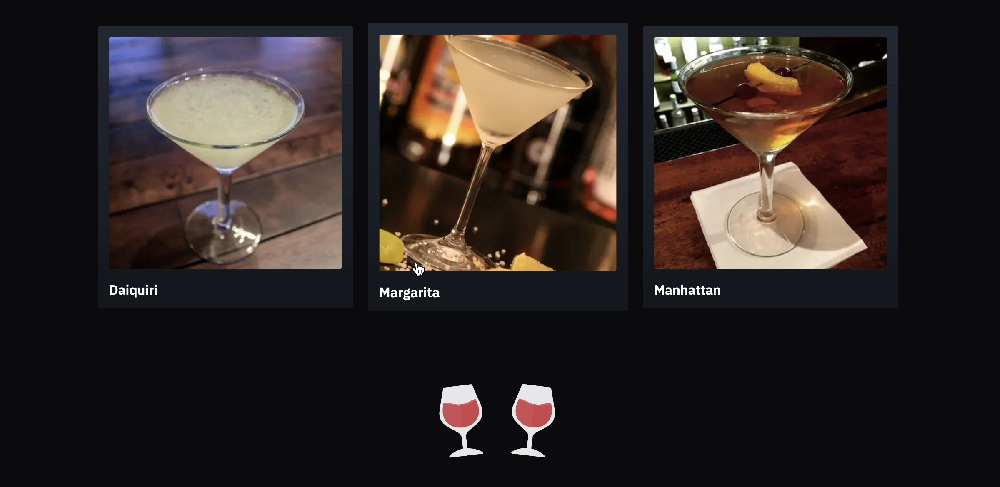

# The Cocktail Corner

Cocktail Explorer is a mobile application that allows users to browse a list of cocktails fetched from TheCocktailDB API. Users can view detailed information about each cocktail by clicking on it, which navigates them to a dynamic route with the drink's details.

## Table of Contents

- [Installation](#installation)
- [Usage](#usage)
- [API Reference](#api-reference)
- [Features](#features)
- [Design Patterns](#design-patterns)
- [Screenshots](#screenshots)
- [Technologies Used](#technologies-used)
- [Contact Information](#contact-information)
- [Resources](#resources)

## Installation

1. **Clone the repository:**
   ```bash
   git clone https://github.com/RadinaAvramova/CocktailsApp
   ```
1. **Navigate to the project directory:**
   ```bash
   cd CocktailsApp
   ```
1. **Install dependencies:**
   ```bash
   npm install
   ```

## Usage

**Run the development server:**

```bash
npm run dev
```

## API Reference


This project uses [TheCocktailDB API](https://www.thecocktaildb.com/api.php) to fetch cocktail data. Below are the key endpoints used in the application:

### Get a List of Cocktails

- **Endpoint:** `/filter.php`
- **Method:** `GET`
- **Description:** Retrieves a list of cocktails based on a various filters.
- **URL:**
  ```plaintext
  https://www.thecocktaildb.com/api/json/v1/1/filter.php?c={category}
  https://www.thecocktaildb.com/api/json/v1/1/filter.php?a={alcoholic}
  https://www.thecocktaildb.com/api/json/v1/1/filter.php?i={ingredient}
  https://www.thecocktaildb.com/api/json/v1/1/filter.php?g={glass}
  ```

### Example response

```json
{
  "drinks": [
    {
      "strDrink": "Margarita",
      "strDrinkThumb": "https://www.thecocktaildb.com/images/media/drink/5noda61589575158.jpg",
      "idDrink": "11007"
    },
    {
      "strDrink": "Blue Margarita",
      "strDrinkThumb": "https://www.thecocktaildb.com/images/media/drink/bry4qh1582751040.jpg",
      "idDrink": "11118"
    }
  ]
}
```

### Get information on a cocktail

- **Endpoint:** `/lookup.php`
- **Method:** `GET`
- **Description:** Retrieves information on a cocktail based on an id or name.
- **URL:**
  ```plaintext
  https://www.thecocktaildb.com/api/json/v1/1/lookup.php?s={drinkId}
  https://www.thecocktaildb.com/api/json/v1/1/search.php?s={drinkName}
  ```

### Example response

```json
{
  "idDrink": "11007",
  "strDrink": "Margarita",
  "strDrinkAlternate": null,
  "strTags": "IBA,ContemporaryClassic",
  "strVideo": null,
  "strCategory": "Ordinary Drink",
  "strIBA": "Contemporary Classics",
  "strAlcoholic": "Alcoholic",
  "strGlass": "Cocktail glass",
  "strInstructions": "Rub the rim of the glass with the lime slice to make the salt stick to it. Take care to moisten only the outer rim and sprinkle the salt on it. The salt should present to the lips of the imbiber and never mix into the cocktail. Shake the other ingredients with ice, then carefully pour into the glass.",
  "strDrinkThumb": "https://www.thecocktaildb.com/images/media/drink/5noda61589575158.jpg",
  "strIngredient1": "Tequila",
  "strIngredient2": "Triple sec",
  "strIngredient3": "Lime juice",
  "strIngredient4": "Salt",
  "strMeasure1": "1 1/2 oz",
  "strMeasure2": "1/2 oz",
  "strMeasure3": "1 oz",
  "dateModified": "2015-08-18 14:42:59"
}
```

## Features

**Homepage Drink List** - Displays a comprehensive list of drinks, featuring images and names.

**Dynamic Drink Details** - Each drink has a detailed page for more information, including ingredients, measurements, and preparation instructions.

**Filters for different types of drinks** - See a list and filter by all, popular, latest or non-alcoholic drinks.

**Responsive Design** - Fully responsive, ensuring a seamless and enjoyable browsing experience on any device.

**Server-side Rendering** - This site leverages NextJS server side rendering for faster load times and greater user experience.

**Custom Animations** - Custom animations are featured throughout the application using Framer Motion.

**ShadCN components** - Highly customisable pre built components are featured throught the app.

**Simulated Database Response** - I have intentional made the API fetch the data slower to simulate a database and to show user feedback as well as showcasing loading and fetching states.

## Design Patterns

**Maintainability** - I have tried to keep components modular and scalable and dynamic, with an emphasis on reusability and readability.

**Server fetching and formatting** - I am handling fetching and formatting of data on the backend, allowing for tsx components to render data without unnecessary logic or formatting on the front end. I have achieved this by creating dynamic helper functions that process and reformat the data.

**Dynamic fetch function** - I have created two highly flexible server functions to handle all the data fetching necessary for the application.

**Type Safety** - The use of types and interfaces is constant throughout the app, without a single use of the word 'any' to override the type check.

**File and folder structure** - The app is organised to seperate components based on their role, as well as separating types, utils, server functions and constants.

**Saving and committing work often** - I regularly made commits and pull requests to github using a total of 36 pull requests with clear commit messages. This keeps the project organised and allows me to work on tasks without altering the main codebase.

## Screenshots

### Multiple filtering options


### Loading Animations



### Carousel showing popular drinks


### Drink Information


### Carousel showing popular drinks


### Technologies Used


## Resources:

- [TheCocktailDB](https://www.thecocktaildb.com/api.php) - Connect to this great free API.
- [Next.js](https://nextjs.org/docs) - Explore the powerful features and API of Next.js.
- [React](https://react.dev/) - Dive deeper into the world of React.
- [Tailwind](https://v2.tailwindcss.com/docs/) - Master the utility-first approach with Tailwind CSS.
- [ShadCN](https://ui.shadcn.com/docs) - Discover the comprehensive UI components offered by ShadCN.
- [Framer Motion](https://www.framer.com/motion/) - Animate with ease using Framer Motion.
